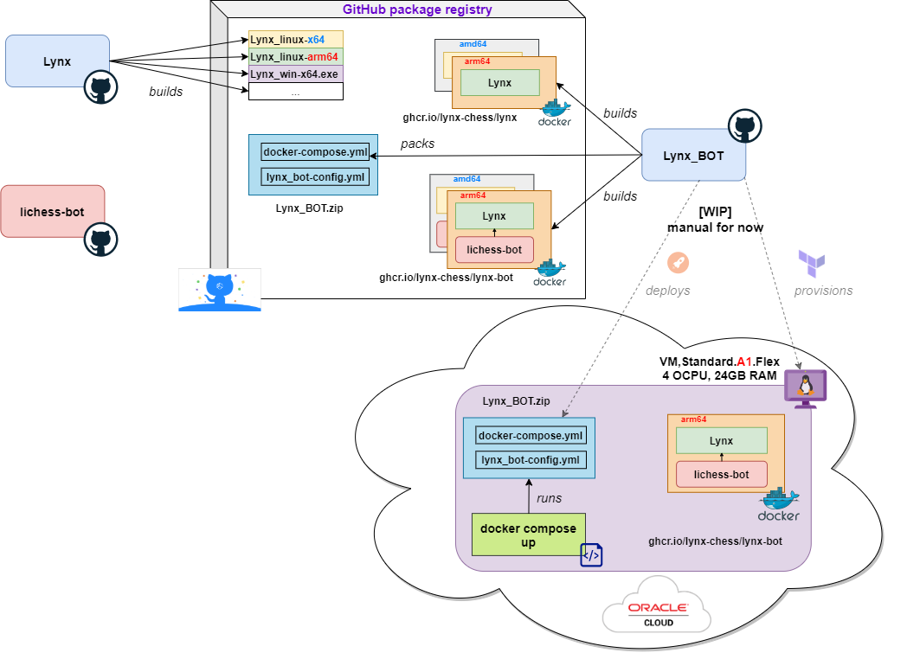

# 🤖 Lynx_BOT 🤖


<p align="center">
  <a href="https://lichess.org/?user=lynx_bot#friend">👉 <b>Play me on Lichess</b> 👈</a>
</p>

[](https://lichess.org/@/Lynx_BOT/perf/bullet)
[](https://lichess.org/@/Lynx_BOT/perf/blitz)
[](https://lichess.org/@/Lynx_BOT/perf/rapid)
[](https://lichess.org/@/Lynx_BOT/perf/classical)

This repo sets up [**Lynx**](https://github.com/lynx-chess/Lynx) chess engine to play in lichess.org.

Although the code is open source so that it can be used to play from any account, **the official Lynx account is [Lynx_BOT](https://lichess.org/@/Lynx_BOT)**.

A [fork](https://github.com/lynx-chess/lichess-bot) of the 'official lichess bot client' ([ShailChoksi/lichess-bot](https://github.com/ShailChoksi/lichess-bot)) is used.

Last version:

[![Lynx_BOT release][releaselogo]][releaselink]

## Instructions

Instructions to run Lynx chess engine in your own lichess account.

If you're only interested in the binaries, they're available [here](https://github.com/lynx-chess/Lynx/releases).

### Requirements

- Owning a Lichess Bot account. You must **not** attempt this with a regular Lichess account. Learn [here](https://lichess.org/api#operation/botAccountUpgrade) how to upgrade an account to a Bot one.

- [Docker](https://docs.docker.com/get-docker/).

- [Docker Compose](https://docs.docker.com/compose/install/).

### Steps

- [Create](https://lichess.org/account/oauth/token/create?) a Lichess API Access Token with `bot:play` permissions.

- Download [the latest release artifact](https://github.com/lynx-chess/Lynx_BOT/releases/latest) to an empty directory.

- In that directory, create an .env file with your API token, i.e.:

  ```bash
  echo LICHESS_API_TOKEN="<YOUR_API_TOKEN>" > .env
  ```

- Adjust any parameters you desire in `lynx_bot.config.yml`.

- Run `docker compose`:

  ```bash
  docker compose up
  ```

## Official Lynx_BOT architecture



## Licenses

[Lynx](https://github.com/lynx-chess/Lynx) chess engine has a more permissive MIT license, but since this repository makes use of [lichess-bot](https://github.com/ShailChoksi/lichess-bot) as well, it's also licensed under **AGPL-3.0**.

| Project                                                   | License      | Relationship |
| --------------------------------------------------------- | ------------ | ------------ |
| [Lynx](https://github.com/lynx-chess/Lynx)                | MIT          | Dependency   |
| [lichess-bot](https://github.com//lynx-chess/lichess-bot) | AGPL-3.0     | Dependency   |
| [lc0-docker](https://github.com/vochicong/lc0-docker)     | -            | Inspiration  |
| [**Lynx_BOT**](https://github.com/lynx-chess/Lynx_BOT)    | **AGPL-3.0** | This project |

[releaselink]: https://github.com/lynx-chess/Lynx_BOT/releases/latest
[releaselogo]: https://img.shields.io/github/v/release/lynx-chess/Lynx_BOT
